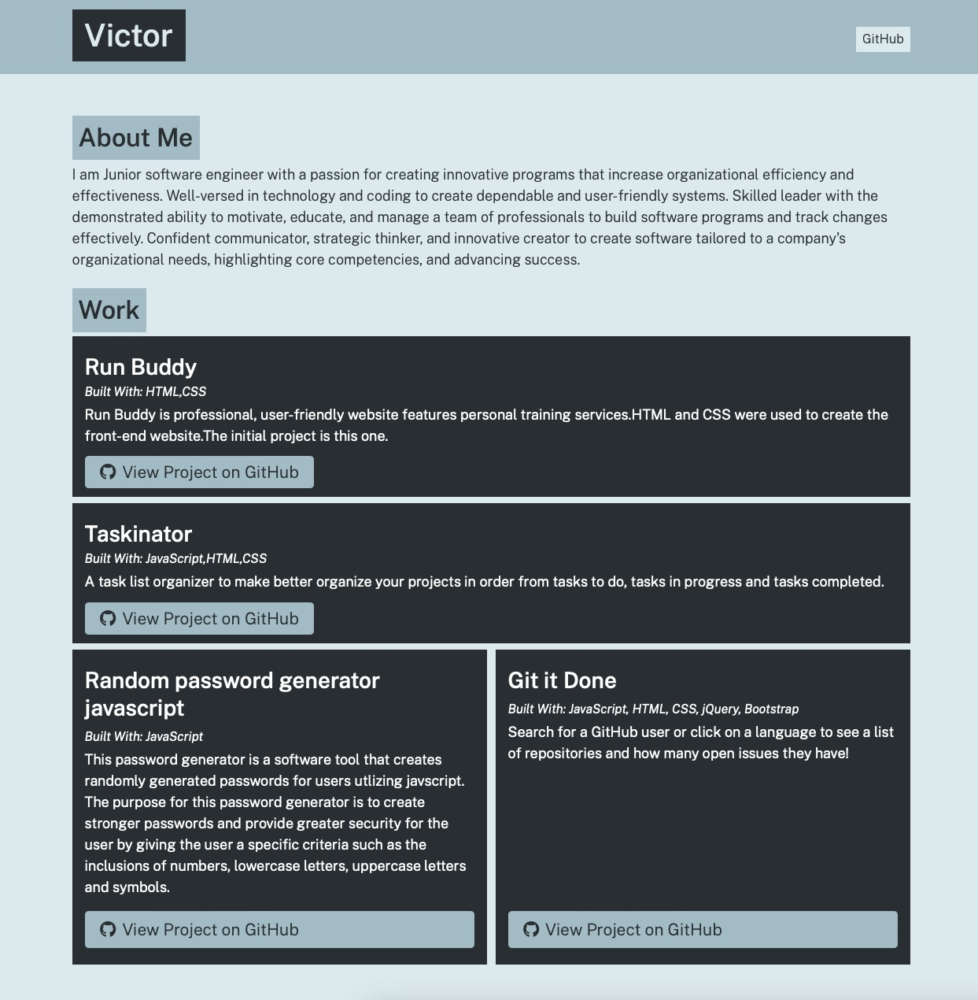

# Portfolio Generator

## Description 
A Node.js app for making a page for a professional portfolio

## Installation

To use this application, please install: 
```
npm i inquirer
```

## Usage
After installing the required npm packages, use the command line to navigate to the root of the application and run `node app`.  Follow prompts to enter project information.  The generated portfolio page will be created in the `./dist` folder. 
    
Screenshot of website



To visit please click on link [link](https://vsoto7697.github.io/portfolio-generator/)


## License


Copyright (c) 2022 Victor Soto